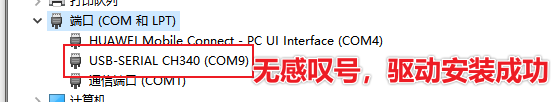

# MicroPython_ESP8266

之前写博客每篇文章基本是独立的，都是按照学习，记录，分享的逻辑。此次想通过有主题的系列文章，带来有稍有深度的分享。

本系列将使用MicroPython驱动ESP8266，借助贝壳物联接入天猫精灵，简易实现智能家居控制体验。

## 开始之前要准备

涉及到软件和硬件并不像以前那么复杂，只需稍许准备即可。

### MicroPython

总觉得编程语言总是越学越难，如果刚上手就能够驱动硬件，初学即巅峰，岂不是美滋滋？

那么MicroPython就比较容易上手，而且可以直观的操作UART，I2C，SPI，PWM，ADC等等外设。想一想初学80C51的时候逐个控制寄存器读写，再到初学STM32的时候使用固件库进行初始化，流程也是非常繁琐。现在ST官方都在推CubeMx，通过可视化的界面，完成底层与外设接口的配置，有效的减少了项目开发前期的工作量。现在都是在挤出时间来捣鼓些小玩意，那就要以最快的速度把东西搞出来，也算是降低了不少时间成本。

本系列默认读者已经掌握基本的Python编程能力。如果是初学者需要自行学习， [廖雪峰](https://www.liaoxuefeng.com/wiki/1016959663602400/)， [菜鸟教程](https://www.runoob.com/python3/python3-tutorial.html) 等Python 3教程都是容易上手的。本系列能够使用到的语法也非常简单，只要理解能力不差（只要笔者描述的够明白），也可以继续学习下去，有关语法的疑问可以遇到之后再通过互联网解答。

MicroPython的相关信息可以通过[MicroPython官网](http://www.micropython.org/) 了解到，不想看官网的可以参考下面谷歌翻译的简介：

> MicroPython是Python 3编程语言的一种精简而高效的实现，其中包括Python标准库的一小部分，并且经过优化可在微控制器和受限环境中运行。
>
> MicroPython pyboard是一种紧凑的电子电路板，可在裸机上运行MicroPython，从而为您提供了可用于控制各种电子项目的低级Python操作系统。
>
> MicroPython充满了高级功能，例如交互式提示，任意精度整数，闭包，列表理解，生成器，异常处理等。 但是它足够紧凑，可以在256 k的代码空间和16 k的RAM中运行。
>
> MicroPython的目标是与普通Python尽可能兼容，从而使您可以轻松地将代码从桌面传输到微控制器或嵌入式系统。

一句话概括，可以使用Python驱动MCU。

### ESP8266

硬件的选择本质上是坑多和坑少的尝试，别问我为什么知道的。

大多数开发阶段，为了迅捷方便，可以买市场上已经成熟的模块。就像买电脑一样，买一台已经组装好的机器，而不是东市买内存，西市买主板，南市买显卡，北市买电源。

当然必须得是超高性价比的，要便宜还要能打的那种。在MicroPython官网提供了一些硬件模块，针对该网站学习量身定制的。可是价格也不太亲民，即使在某宝上，pyboard的套件也要大几十往上。

而同样支持MicroPython的ESP8266模块，ESP32的模块就比较便宜，并且该有的功能都有，就是想要这种便宜又能打的。


此处不是广告，笔者某宝买的ESP8266串口wifi模块才12.6元一个还免运费（这TM比STM 32 C8T6 还便宜） [链接在这需要自取](https://item.taobao.com/item.htm?spm=a230r.1.14.6.44c3c5fej8bdIo&id=531755241333&ns=1&abbucket=6#detail) 。

注意，此产品发货的时候，下方两排排针是不焊接的，需要到货之后自行焊接。嫌麻烦的同学可以询问店家是否可以提供焊接，或找有工具的同学帮忙，不焊接排针的情况下，板载上有一颗LED灯可以进行控制。

ESP8266基于MicroPython可以提供的外设资源和驱动有：

- Delay and timing
- Timers
- Pins and GPIO
- UART(serial bus)
- PWM(pulse width modulation)
- ADC(analog to digital conversion)
- Software SPI bus
- Hardware SPI bus
- I2C bus
- Real time clock(RTC)
- Deep-sleep mode
- OneWire driver
- NeoPixel driver
- APA102 driver
- DHT driver

这些外设和驱动都非常有用，若能将这些功能悉数收入囊中，也是收获颇丰了。

### 硬件准备

#### MicroUSB数据线

上述ESP8266模块烧录程序的方式是通过ESP82266板载的一组UART0 (GPIO1=TX, GPIO3=RX)，这组UART0在模块上连接了一个串口芯片 CH340 (也可能是其他的型号，电脑要安装对应型号的驱动)。因此需要MicroUSB的接口连接电脑USB，进行供电和数据传输。


所需要的MicroUSB数据线（就是以前很多人说的安卓接口）接口示意见下图：


#### 其他设备

有条件的同学，可以一同采购其他的外设。结合本系列后面的内容，会用到0.96inch的OLED屏幕，HC-SR501人体红外感应模块，DH11温湿度模块，SG90舵机等。

如果有其他驱动需求也可以酌情选择，有目的性驱动可以更好的督促学习。

这些设备也都是在上面的店铺采购的，价格也比较便宜。根据ESP8266的资源来驱动这些硬件，对进行MicroPython的学习很有帮助。

### 软件准备

#### 串口相关

[CH340的串口驱动程序]()，用于USB连接电脑之后，电脑识别到设备。

串口调试助手，用于使用Python REPL(交互式解释器，类似于CMD进入Python的交互界面)，使用终端显示器对程序进行仿真。

此时需要可以进行输入的串口调试助手，像常用带写入的串口调试助手都可以，包括下面要用的MicroPython File Uploader 也可以，笔者习惯使用 [Tera Term]()。

#### MicroPython File Uploader

这款软件用来读取或写入ESP8266模块中4M的Flash内的文件，比如内部的的boot.py和main.py等。

区别于REPL，可以在Windows中完成程序的编辑，再通过USB线缆传输到Flash中，接着复位，就会运行编写的程序。

#### 最好有个编辑器

编辑器要选自己习惯使用的，Notepad ++ 也好（这个得注意，Python对缩进要求严格，建议Tab一定要改成制表符），Sublime Text也好，Ultra Edit也好，怎么方便怎么来，笔者就使用个人熟悉的Atom。

### 环境准备

Windows端要自己安装Python 3，网上有很多教程，这里指路廖雪峰的Python教程之[安装Python](https://www.liaoxuefeng.com/wiki/1016959663602400/1016959856222624) ；注意哦，安装目录可以选在`Customize installation` 选项自己选择，建议默认安装在`C:\Python3` 。

至此本系列的准备工作就做完了，接下来就可以开始真正的学习了。

## 手把手开始点灯

接着折腾，接着学。

### ESP82266通用信息

ESP8266是Espressif Systems推出的一种流行的，具有WiFi功能的片上系统（SoC）。相关的Datasheet可以在[这里下载]() 。

MicroPython for ESP8266库（）应该叫方法）中的Pin number都是基于ESP8266的芯片，而不是ESP8266模块引出的引脚（意思就是不是那焊接的两排排针的序号）。

为了后面使用方便，下里提供一些技术规格：

- CPU频率：80 MHz，可以超频至160 MHz；
- 总可用RAM：94KB（部分预留给系统）；
- 外部FlashROM：存放程序和数据，通过SPI烧录FLash，当前模块挂在的胃4 MB；
- GPIO：16 + 1（GPIOs 可复用为其他功能，包括外部FlashROM，UART，深睡唤醒等等）；
- UART：一组收发UART（无硬件握手协议），一组只有TX的UART；
- SPI：2组SPI接口（一组用于FlashROM）；
- I2C：无外部I2C（在任何引脚上均可以实现）；
- 编程：使用UART的BootROM引导程序。

#### 内部资源限制

ESP8266的片上资源非常有限（RAM），因此建议避免分配太多的容量给对象（list列表，dictionaries字典）。使用完文件系统，sockets等要注意及时关闭。

关于ESP8266启动进程，Real-time clock，Sockets 和 WiFi buffer 溢出，SSL/TLS限制的信息，可参考[官方文档](http://docs.micropython.org/en/latest/esp8266/general.html) 次出不再讲述。

### 开始使用MicroPython

将ESP8266模块通过MicroUSB线缆，与PC连接。默认此时已经完成了ESP8266模块的上电操作。

### 电脑识别串口

电脑端应该已经识别了ESP8266模块上的串口芯片，如果在资源管理器中看到对应的COM口出现感叹号，就必须要安装串口相关驱动了（这个之前有提到过）。下图所示的状态就是已经识别并成功安装驱动。



或者可以在CMD控制台中输入`mode` 指令：

```bash
C:\Users\Administrator>mode
```

控制台中就会列举出已经连接的串口，如下图所示：


#### 串口波特率修改方式

串口波特率如果不是115200，可以在设备管理器中进行修改，操作步骤如下（这个GIF制作的有点BUG，不过不影响内容；）：


### 获取固件

固件（firmware）可以理解为电脑的系统，有三种版本，适配不同的外挂Flash大小；本系列ESP8266模块外挂Flash大小为4M，所以可以选用Stable firmware，[这里是下载地址](http://micropython.org/download/esp8266/) 。选择最新版的即可：

- esp8266-20200911-v1.13.bin (elf, map) (latest)

### 烧录固件

需要使用esptool来烧录刚才下载好的固件。

#### 安装esptool

在CMD控制台中使用`pip` 工具安装esptool。pip为Python解释器的工具，此处使用python 3，对应指令应修改为：

```bash
pip3 install esptool
```

安装好之后键入`esptool.py version` ，可以查看当前工具版本：

```bash
C:\Users\Administrator>esptool.py version
esptool.py v2.6
2.6
```

这样，就可以愉快的使用此工具进行ESP8266的固件烧录了。

#### 清除Flash

可以使用这样的命令清除ESP8266模块上flash内容（现在端口修改为COM8）：

```bash
esptool.py --port COM8 erase_flash
```

如果擦除成功会出现下面的状态：

```bash
C:\Python3\Lib\site-packages>esptool.py --port COM8 erase_flash
esptool.py v2.6
Serial port COM8
Connecting....
Detecting chip type... ESP8266
Chip is ESP8266EX
Features: WiFi
MAC: b4:e6:2d:34:ae:9d
Uploading stub...
Running stub...
Stub running...
Erasing flash (this may take a while)...
Chip erase completed successfully in 9.2s
Hard resetting via RTS pin...

C:\Python3\Lib\site-packages>
```

如果命令行执行一直显示`serial.serialutil.SerialException: could not open port 'COM8': PermissionError(13, '拒绝访问。', None, 5)` ，有两点建议：

1. 命令行切换到esptool.py的安装目录：`C:\Python3\Lib\site-packages>` ;
2. 重新对ESP8266模块重新上电。

直至出现烧录，结束之后可以通过板载的`RST`按钮进行复位。

#### 可以烧录了


### 使用REPL prompt点灯

使用REPL

点灯，循环


## 常用外设的驱动


## 驱动0.96 Inch OLED


## 接入贝壳物联
